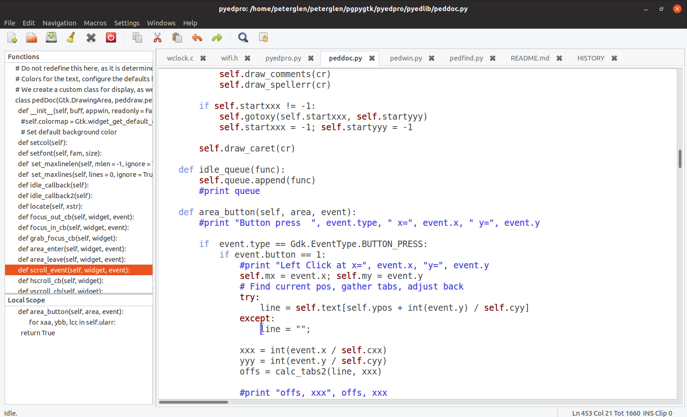

#   PyEdPro README

## Python editor.

   Welcome to PyEdPro. This is modern multi-platform editor. Simple, powerful,
configurable, extendable. Goodies like macro recording / playback, spell check,
column select, multiple clipboards, unlimited undo ... makes it an editor
that I use every day.

 This project is a successor of pyedit, after porting it to GTK3. PyEdPro
 will run anywhere PyGObject can run.

  Working and tested platforms currently are:

        Win 7 .. Win 10 ...
        Centos 6 .. 7 Ubuntu 14 ... 16 ...  20.x (should run on any linux )
        Windows (Native) plus MSYS2, Mingw,
        Raspberry PI 3, Raspberry PI 4, ...

  I mainly run it on Ubuntu, and in Win32 / MSYS2, some Fedora, Windows 10,
and the Raspberry-Pi. It behaves consistently on all these platforms,
it is an absolute joy to edit in a different platform without the learning
curve of new keystrokes.  If you want an editor  that works the
same way in all your workspaces, PyEdPro is the one.

### New:

  Implemented html preview. Just right click on the file body, an select the
corresponding menu item.
Implemented markdown preview. Right click ...
Implemented M4 preview. The files are pulled in from the current directory,
and expanded with the m4 macro processor. The results than are previewed
in an html window. (Yes, head and footer are now one file for the whole site,
the way it should be) Right click ... and look for: Filter to M4

  Added drag and drop. Accepts file name from file manager, and accepts clipboard text.
The dropped content is inserted where the editor's caret is. (not where the cursor is)
The caret is moved to the end of insertion.

  Pyedpro now has buffer diff. Right clicking on the file's tab header presents a menu.
One may select the diff source, the diff destination (or target). When the source and
target is selected, a diff window slides in from the right. The diff window presents
th diff of the two buffers, relative to 'target'. The three buffers navigate in sync,
one may inspect them. The sync is somewhat intelligent by guessing the correct
position of the cursor on the current buffer. Please note, that this diff is somewhat
simple, as it marks only --del --ins points. Again, its simplicity yields benefits
that are surprizing. For instance; hand merging small changes become more visual. And
yes, it is no substitute for a real diff.

  The diff buffer is read only. To refresh the diff, select
from the tab's right click menu 'Re-diff buffers'. The diff-ing can be stopped from the
same right click menu, by selecting 'Stop Diffing'. The diff algorythm is crude, but
the simplicity has its advantages. Speed and predictibility.

   PyEdPro.py has macro recording/play, search/replace, one click function navigation,
auto backup, undo/redo, auto complete, auto correct, syntax check, spell suggestion
 ... and a lot more.

   The recorded macros, undo / redo information / editing session detail persists
 after the editor is closed.

    The spell checker can check code comments. The parsing of the code is
rudimentary,  comments and strings are spell checked. (Press F9) The code is filtered
out for Python and  'C', which assures most derivative languages have correct
code spell code check. The whole file can be checked in text spell mode.
(Shift-F9) The spell checker is executed on live text. (while typing)

   Syntax highliting. Again, a simpler parser for speed. Succeeds in its mission with
giving great visual without speed impact.

   PyEdPro is fast, it is extendable, as python lends itself to easy extending. The
editor has a table driven key mapping. One can easily edit the key map in
keyhand.py, and the key actions in acthand.py

  If you encounter blank screen after start, cairo is not installed. The terminal interface
will complain, but if you start from the GUI, you can see the message in the
log window. (Menu->Windows->Show_Log) To install cairo type 'sudo apt install cairo'.

 The default key map resembles gedit / wed / etp / brief. Full ASCII;
 Any fixed font can be configured.

  See KEYS file for the list of keyboard shortcuts or press F3 in the
editor or look at the file in pyedlib/KEYS.

  On initial start, PyEdPro shows a left pane and a top pane. The left pane
is for function summary and the top pane is for double view of the same file.
(to see the caller and the callee) These panes can be hidden with the mouse by
dragging on their handle, or by the key combination Alt-Q (Shift-Alt-Q for
the left pane)

  PyEdPro remembers a lot about the editing session. Loaded files, cursor positions,
fonts, font size, colors, search strings, goto numbers, undo / redo info,
window positions ... and more.
 This is all stored in the directory ~/.PyEdPro. You may safely delete that
directory to start PyEdPro with no memory of what has been done.

  Starting PyEdPro with no command line arguments will put you back to the
previous session, exactly where you left off.

 The editor will work on all PyGobject platforms, and can open UNIX and Windows files
transparently. It will save the file as the current platform's native CRLF
convention dictates.

  Developer's note: in order to make PyEdPro multi platform, we save
the configuration info into a SQLite database in the ~/.PyEdPro directory.

     (~/ stands for the user's home directory)

 Contributors are welcome.

The author,

      Peter Glen

Screen from a regular session, note the function list on the left:

Screen from Ubuntu:

License:    Open Source, FreeWare

